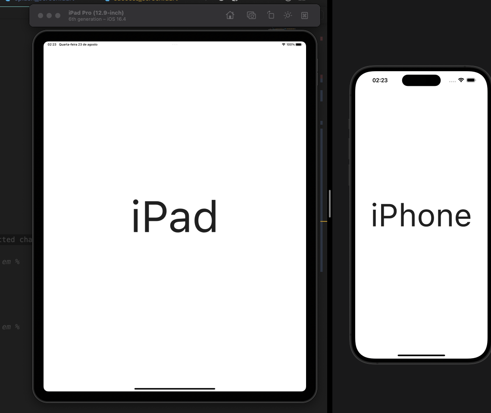

# flutter_responsivity_widget

 by: [Eliezer Antonio](https://github.com/eliezerantonio)

##### Voçê pode obter esse resultado totalmente ajustavel ao tamanho da sua tela

  
  
## Nota

A maioria de nos do Flutter adicionamos tamanhos fixos nos nosso componentes quer seja texto, imagens ou outro widget, e as vezes por causa disso em  diferentes tamanhos de tela acabamos por  cair no famoso overflow, Com esse  package cada componente vai se ajustando em cada diferente tamanho de dispositivo, apesar de existir outras abordagens pra solucionar isso mas uma adaptação automática dando o tamanho certo em cada device pode ser melhor em termos de UX  e tem mais outras vantagens

## Funcionalidades

- [X] Width in percent
- [X] Height in percent
- [X] Diagonal in percent
- [X] Detect tablet size

## Plataformas suportadas

- Flutter Android
- Flutter iOS
- Flutter web
- Flutter desktop

## Visualização

## Instalação

Adicionar `flutter_responsivity_widget: ^0.0.1` no seu  ficheiro de dependências`pubspec.yaml`. E importa:

```dart
import 'package:flutter_responsivity_widget/flutter_responsivity_widget.dart';;
```

## Como usar

```dart

  ```

## Exemplos

```dart

class ExamplePage extends StatelessWidget {
  const ExamplePage({super.key});

  @override
  Widget build(BuildContext context) {
    final responsive = Responsive(context);
    return Scaffold(
      backgroundColor: Colors.white,
      body: Center(
        child: Image.asset(
          'assets/logo_jp.jpg',
          width: responsive.wp(100), // wp- width em  %
          height: responsive.hp(100), // hp-height em %
        ),
      ),
    );
  }
}


  ```  

### Exemplo com texto

###### Para textos é recomendado usar a diagonal

  ```dart

class ExamplePage extends StatelessWidget {
  const ExamplePage({super.key});

  @override
  Widget build(BuildContext context) {
    final responsive = Responsive(context);
    return Scaffold(
      backgroundColor: Colors.white,
      body: Center(
        child: Text(
          'Example',
          style: TextStyle(
            fontSize: responsive.dp(8), // dp- diagonal em %
          ),
        ),
      ),
    );
  }
}


  ```  

##### Resultado  do exemplo acima


### Exemplo com  detectando tamanho da tablet

###### Caso você queira mostrar conteudos diferentes para uma tablet e um telefone

  ```dart

class ExamplePage extends StatelessWidget {
  const ExamplePage({super.key});

  @override
  Widget build(BuildContext context) {
    final responsive = Responsive(context);
    final isTablet = responsive.isTablet;
    return Scaffold(
      backgroundColor: Colors.white,
      body: Center(
        child: isTablet
            ? Text(
                'iPad',
                style: TextStyle(
                  fontSize: responsive.dp(10), /
                ),
              )
            : Text( 'iPhone',
                style: TextStyle(
                  fontSize: responsive.dp(10), 
                )
              ),
      ),
    );
  }
}


  ```

### resultado do exemplo acima

 

## My Packages
  
  [flutter_carousel_intro](https://github.com/eliezerantonio/flutter_carousel_intro)
